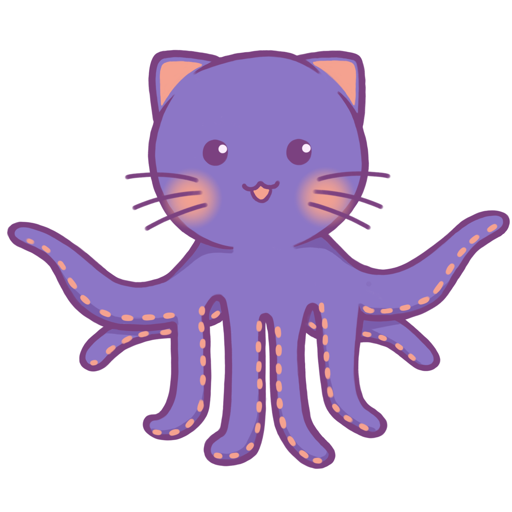

# GitHubGato

*GitHubGato is a new and innovated way to learn and play with coding commands on GitHub. GitHubGato incorporates a game like mechanic that engages users in learning and makes learning programs easier. Our team is inspired to improve the education curiculmn in programming through these innovative ways of learning that is user and beginner friendly, engaging, encourages users to not only learn but to want to purse in this field of study, and most importantly, let users have fun with coding.*
# Inspiration
- GitHubGato's mascot, Gato, is inspired by NYU Hackathon's purple cat and GitHub's Octocat.
- The game mechanic added to learning is inspired our developers' love for games and Flexbox Froggie.
# Building Blocks
- **February 25, 2022:** GitHubGato started as a basic website design on Figma. We picked our theme, colors, and fonts for the base of the website before building on top of it. We flushed out ideas for the landing page, lessons, game stages, and mascot designs. 
- **February 26, 2022:** We finished Gato's different designs for each page and lesson. Our developers worked on the coding and placement of the game using GitHub and html to bring this project to life.
# Challenges
- Many great ideas, very limited time
- Formatting and design of site
- Obtaining domain
- Example game stage ideas and problems
# Accomplishments
- Our Gato designs
- Our game branches and levels
- Our contributions to the project
# What We Learned
- How to re-write long technical documentation into simple easy to understand format for new GitHub users to understand
# Next Steps
GitHubGato will take it's next steps towards...
- Organizing all GitHub commands into a resource page for easy access 
- Creating learning modules 
- Developing more game stages for each module and lesson 
- Adding in user goals and achievements 

## Made with ❤️ by Baruch AIS but Cooler Team:
| Cirill Dalangin | Hao Kai (Kevin) Liao | Ying Mai |
| :----: | :---: | :---: |
|  [🌍](https://florenz.tech/) [💻](https://github.com/cdalangin) [🤝](https://www.linkedin.com/in/cfdalangin/) |   [💻](https://github.com/haokliao) [🤝](https://www.linkedin.com/in/haokliao/) |   [💻](https://github.com/Maiyuwu) [🤝](https://www.linkedin.com/in/ying-m-mai/) |